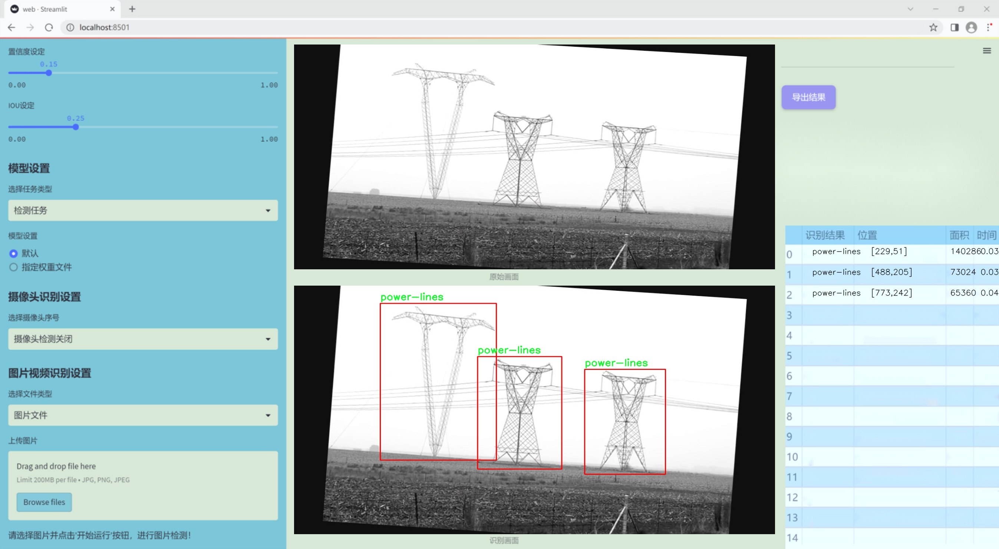
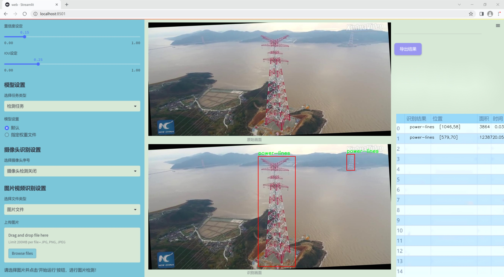
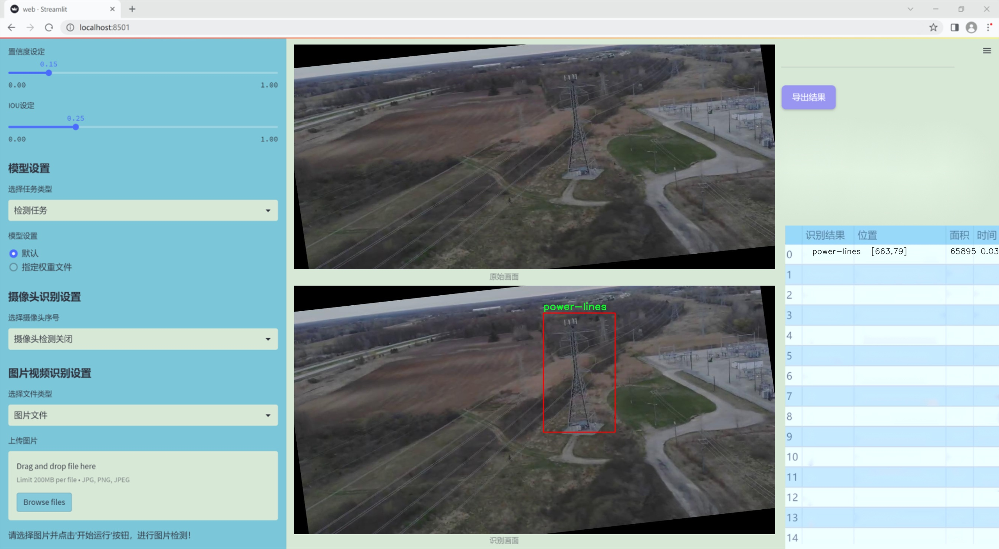
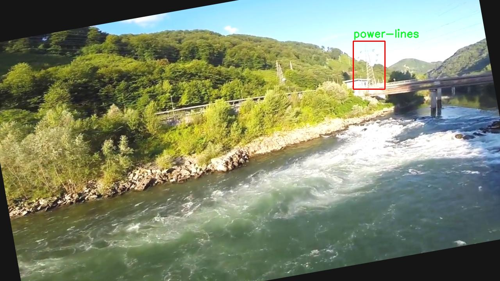
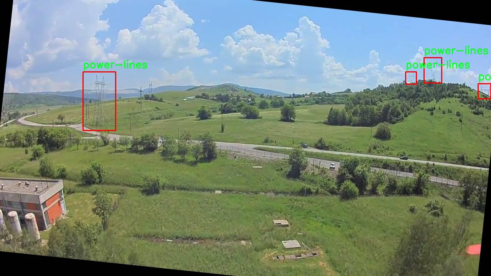
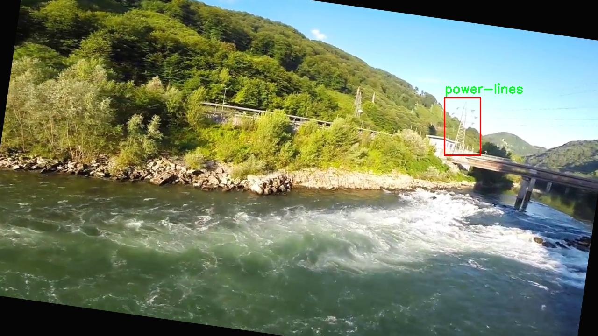
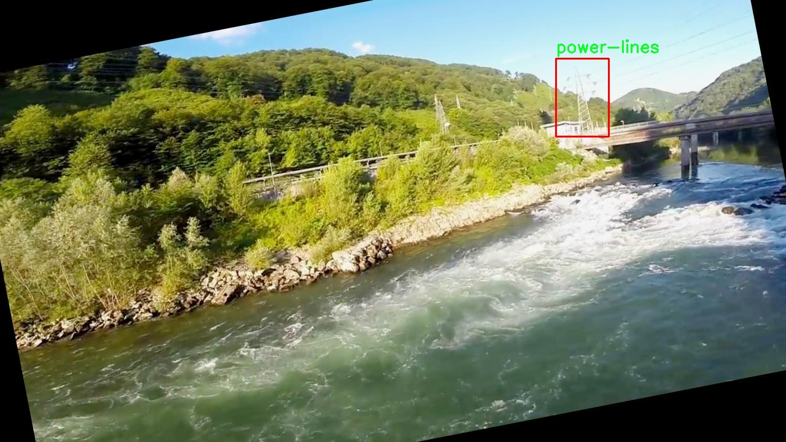
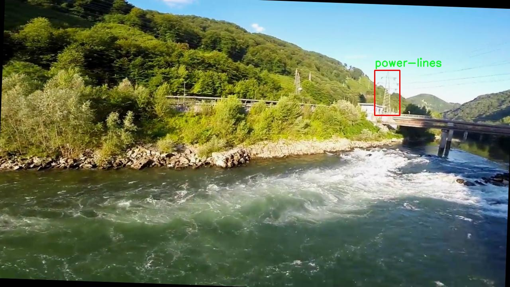

# 改进yolo11-DAttention等200+全套创新点大全：电力设施检测系统源码＆数据集全套

### 1.图片效果展示







##### 项目来源 **[人工智能促进会 2024.11.01](https://kdocs.cn/l/cszuIiCKVNis)**

注意：由于项目一直在更新迭代，上面“1.图片效果展示”和“2.视频效果展示”展示的系统图片或者视频可能为老版本，新版本在老版本的基础上升级如下：（实际效果以升级的新版本为准）

  （1）适配了YOLOV11的“目标检测”模型和“实例分割”模型，通过加载相应的权重（.pt）文件即可自适应加载模型。

  （2）支持“图片识别”、“视频识别”、“摄像头实时识别”三种识别模式。

  （3）支持“图片识别”、“视频识别”、“摄像头实时识别”三种识别结果保存导出，解决手动导出（容易卡顿出现爆内存）存在的问题，识别完自动保存结果并导出到tempDir中。

  （4）支持Web前端系统中的标题、背景图等自定义修改。

  另外本项目提供训练的数据集和训练教程,暂不提供权重文件（best.pt）,需要您按照教程进行训练后实现图片演示和Web前端界面演示的效果。

### 2.视频效果展示

[2.1 视频效果展示](https://www.bilibili.com/video/BV12FDwYEE3V/)

### 3.背景

研究背景与意义

随着全球能源需求的不断增长，电力设施的安全与稳定运行变得愈发重要。电力设施，包括电线、风力涡轮机、天线和烟囱等，构成了现代电力系统的基础。然而，传统的人工巡检方式不仅效率低下，而且容易受到人为因素的影响，导致漏检或误检的情况频繁发生。因此，亟需一种高效、准确的自动化检测系统，以提升电力设施的监测能力和维护效率。

在此背景下，基于改进YOLOv11的电力设施检测系统应运而生。YOLO（You Only Look Once）系列模型因其在实时目标检测中的优越性能而受到广泛关注。YOLOv11作为该系列的最新版本，具备更高的检测精度和更快的处理速度，适合于复杂环境下的电力设施检测任务。通过对YOLOv11进行改进，我们可以进一步优化其在特定场景下的表现，提升对电力设施的识别率和定位精度。

本研究将利用包含1300张图像的“power-lines”数据集，涵盖了天线、烟囱、电线和风力涡轮机等多个类别。这一数据集为模型的训练和测试提供了丰富的样本，能够有效支持模型在多样化场景下的学习与适应。通过对数据集的深入分析和处理，我们将为改进YOLOv11模型提供必要的基础，确保其在实际应用中的可靠性和有效性。

综上所述，基于改进YOLOv11的电力设施检测系统不仅具有重要的理论研究价值，也具备广泛的实际应用前景。通过提升电力设施的检测效率和准确性，我们能够为电力行业的安全管理提供有力支持，进而推动智能电网的发展与完善。

### 4.数据集信息展示

##### 4.1 本项目数据集详细数据（类别数＆类别名）

nc: 4
names: ['antenna', 'chimney', 'power-lines', 'wind-turbine']


该项目为【目标检测】数据集，请在【训练教程和Web端加载模型教程（第三步）】这一步的时候按照【目标检测】部分的教程来训练

##### 4.2 本项目数据集信息介绍

本项目数据集信息介绍

本项目所使用的数据集名为“power-lines”，旨在为改进YOLOv11的电力设施检测系统提供高质量的训练数据。该数据集包含四个主要类别，分别为天线（antenna）、烟囱（chimney）、电力线（power-lines）和风力涡轮机（wind-turbine）。这些类别的选择反映了电力设施及其相关结构在实际应用中的重要性，尤其是在电力传输和可再生能源领域。数据集的多样性和丰富性使其能够有效支持目标检测模型的训练，提升模型在复杂环境下的识别能力。

在数据集的构建过程中，研究团队收集了大量来自不同地理位置和气候条件下的图像，以确保数据的多样性和代表性。这些图像不仅涵盖了各种光照条件和背景环境，还包括了不同角度和距离下的电力设施。这种多样化的图像来源使得模型在训练过程中能够学习到更为广泛的特征，从而提高其在实际应用中的鲁棒性和准确性。

此外，数据集中的每个类别都经过精确标注，确保模型在训练时能够获得准确的目标位置和类别信息。这种高质量的标注对于深度学习模型的训练至关重要，因为它直接影响到模型的学习效果和最终的检测性能。通过使用“power-lines”数据集，研究团队期望能够显著提升YOLOv11在电力设施检测任务中的表现，进而为电力行业的智能化发展提供有力支持。











### 5.全套项目环境部署视频教程（零基础手把手教学）

[5.1 所需软件PyCharm和Anaconda安装教程（第一步）](https://www.bilibili.com/video/BV1BoC1YCEKi/?spm_id_from=333.999.0.0&vd_source=bc9aec86d164b67a7004b996143742dc)


[5.2 安装Python虚拟环境创建和依赖库安装视频教程（第二步）](https://www.bilibili.com/video/BV1ZoC1YCEBw?spm_id_from=333.788.videopod.sections&vd_source=bc9aec86d164b67a7004b996143742dc)

### 6.改进YOLOv11训练教程和Web_UI前端加载模型教程（零基础手把手教学）

[6.1 改进YOLOv11训练教程和Web_UI前端加载模型教程（第三步）](https://www.bilibili.com/video/BV1BoC1YCEhR?spm_id_from=333.788.videopod.sections&vd_source=bc9aec86d164b67a7004b996143742dc)


按照上面的训练视频教程链接加载项目提供的数据集，运行train.py即可开始训练



     Epoch   gpu_mem       box       obj       cls    labels  img_size
     1/200     20.8G   0.01576   0.01955  0.007536        22      1280: 100%|██████████| 849/849 [14:42<00:00,  1.04s/it]
               Class     Images     Labels          P          R     mAP@.5 mAP@.5:.95: 100%|██████████| 213/213 [01:14<00:00,  2.87it/s]
                 all       3395      17314      0.994      0.957      0.0957      0.0843

     Epoch   gpu_mem       box       obj       cls    labels  img_size
     2/200     20.8G   0.01578   0.01923  0.007006        22      1280: 100%|██████████| 849/849 [14:44<00:00,  1.04s/it]
               Class     Images     Labels          P          R     mAP@.5 mAP@.5:.95: 100%|██████████| 213/213 [01:12<00:00,  2.95it/s]
                 all       3395      17314      0.996      0.956      0.0957      0.0845

     Epoch   gpu_mem       box       obj       cls    labels  img_size
     3/200     20.8G   0.01561    0.0191  0.006895        27      1280: 100%|██████████| 849/849 [10:56<00:00,  1.29it/s]
               Class     Images     Labels          P          R     mAP@.5 mAP@.5:.95: 100%|███████   | 187/213 [00:52<00:00,  4.04it/s]
                 all       3395      17314      0.996      0.957      0.0957      0.0845


###### [项目数据集下载链接](https://kdocs.cn/l/cszuIiCKVNis)

### 7.原始YOLOv11算法讲解

YOLO11采用改进的骨干和颈部架构，增强了特征提取能力，提高了物体检测的精确度和复杂任务的表现。YOLO11引入精炼的架构设计和优化的训练流程，实现更快的处理速度，同时保持精度和性能之间的最佳平衡。通过模型设计的进步，YOLO11m在COCO数据集上实现了更高的均值平均精度（mAP），同时使用比YOLOv8m少22%的参数，使其在不妥协准确性的情况下更加计算高效。YOLO11可以无缝部署在各种环境中，包括边缘设备、云平台以及支持NVIDIA
GPU的系统，确保最大灵活性。无论是物体检测、实例分割、图像分类、姿态估计，还是定向物体检测（OBB），YOLO11都旨在应对多样的计算机视觉挑战。


##### **Ultralytics YOLO11相比于之前版本的主要改进有哪些？**

Ultralytics YOLO11在其前身基础上引入了几项重要进步。主要改进包括：

  1. **增强的特征提取** ：YOLO11采用改进的骨干和颈部架构，增强了特征提取能力，提高了物体检测的精确度。
  2.  **优化的效率和速度** ：精炼的架构设计和优化的训练流程实现了更快的处理速度，同时保持了准确性和性能之间的平衡。
  3.  **更高的准确性与更少的参数** ：YOLO11m在COCO数据集上实现了更高的均值平均精度（mAP），同时使用比YOLOv8m少22%的参数，使其在不妥协准确性的情况下更加计算高效。
  4.  **环境适应性强** ：YOLO11可以在多种环境中部署，包括边缘设备、云平台以及支持NVIDIA GPU的系统。
  5.  **支持广泛的任务** ：YOLO11支持多种计算机视觉任务，如物体检测、实例分割、图像分类、姿态估计和定向物体检测（OBB）。

我们先来看一下其网络结构有什么变化，可以看出，相比较于YOLOv8模型，其将CF2模块改成C3K2，同时在SPPF模块后面添加了一个C2PSA模块，且将YOLOv10的head思想引入到YOLO11的head中，使用深度可分离的方法，减少冗余计算，提高效率。下面我们来详细看一下这两个模块的结构是怎么构成的，以及它们为什么要这样设计


##### C3K2的网络结构

从下面图中我们可以看到，C3K2模块其实就是C2F模块转变出来的，它代码中有一个设置，就是当c3k这个参数为FALSE的时候，C3K2模块就是C2F模块，也就是说它的Bottleneck是普通的Bottleneck；反之当它为true的时候，将Bottleneck模块替换成C3模块。


##### C2PSA的网络结构

` `C2PSA是对 `C2f` 模块的扩展，它结合了PSA(Pointwise Spatial
Attention)块，用于增强特征提取和注意力机制。通过在标准 `C2f` 模块中引入 PSA
块，C2PSA实现了更强大的注意力机制，从而提高了模型对重要特征的捕捉能力。


##### **C2f 模块回顾：**

**** C2f模块是一个更快的 CSP（Cross Stage Partial）瓶颈实现，它通过两个卷积层和多个 Bottleneck
块进行特征提取。相比传统的 CSPNet，C2f 优化了瓶颈层的结构，使得计算速度更快。在 C2f中，`cv1` 是第一个 1x1
卷积，用于减少通道数；`cv2` 是另一个 1x1 卷积，用于恢复输出通道数。而 `n` 是一个包含 Bottleneck 块的数量，用于提取特征。

##### **C2PSA 模块的增强** ：

**C2PSA** 扩展了 C2f，通过引入PSA( **Position-Sensitive Attention)**
，旨在通过多头注意力机制和前馈神经网络来增强特征提取能力。它可以选择性地添加残差结构（shortcut）以优化梯度传播和网络训练效果。同时，使用FFN
可以将输入特征映射到更高维的空间，捕获输入特征的复杂非线性关系，允许模型学习更丰富的特征表示。

##### head部分

YOLO11在head部分的cls分支上使用深度可分离卷积 ，具体代码如下，cv2边界框回归分支，cv3分类分支。

    
    
     self.cv2 = nn.ModuleList(
                nn.Sequential(Conv(x, c2, 3), Conv(c2, c2, 3), nn.Conv2d(c2, 4 * self.reg_max, 1)) for x in ch
            )
            self.cv3 = nn.ModuleList(
                nn.Sequential(
                    nn.Sequential(DWConv(x, x, 3), Conv(x, c3, 1)),
                    nn.Sequential(DWConv(c3, c3, 3), Conv(c3, c3, 1)),
                    nn.Conv2d(c3, self.nc, 1),
                )
                for x in ch
            )


### 8.200+种全套改进YOLOV11创新点原理讲解

#### 8.1 200+种全套改进YOLOV11创新点原理讲解大全

由于篇幅限制，每个创新点的具体原理讲解就不全部展开，具体见下列网址中的改进模块对应项目的技术原理博客网址【Blog】（创新点均为模块化搭建，原理适配YOLOv5~YOLOv11等各种版本）

[改进模块技术原理博客【Blog】网址链接](https://gitee.com/qunmasj/good)


#### 8.2 精选部分改进YOLOV11创新点原理讲解

###### 这里节选部分改进创新点展开原理讲解(完整的改进原理见上图和[改进模块技术原理博客链接](https://gitee.com/qunmasj/good)【如果此小节的图加载失败可以通过CSDN或者Github搜索该博客的标题访问原始博客，原始博客图片显示正常】

### 动态蛇形卷积Dynamic Snake Convolution

参考论文： 2307.08388.pdf (arxiv.org)

血管、道路等拓扑管状结构的精确分割在各个领域都至关重要，确保下游任务的准确性和效率。 然而，许多因素使任务变得复杂，包括薄的局部结构和可变的全局形态。在这项工作中，我们注意到管状结构的特殊性，并利用这些知识来指导我们的 DSCNet 在三个阶段同时增强感知：特征提取、特征融合、 和损失约束。 首先，我们提出了一种动态蛇卷积，通过自适应地关注细长和曲折的局部结构来准确捕获管状结构的特征。 随后，我们提出了一种多视图特征融合策略，以补充特征融合过程中多角度对特征的关注，确保保留来自不同全局形态的重要信息。 最后，提出了一种基于持久同源性的连续性约束损失函数，以更好地约束分割的拓扑连续性。 2D 和 3D 数据集上的实验表明，与多种方法相比，我们的 DSCNet 在管状结构分割任务上提供了更好的准确性和连续性。 我们的代码是公开的。 
主要的挑战源于细长微弱的局部结构特征与复杂多变的全局形态特征。本文关注到管状结构细长连续的特点，并利用这一信息在神经网络以下三个阶段同时增强感知：特征提取、特征融合和损失约束。分别设计了动态蛇形卷积（Dynamic Snake Convolution），多视角特征融合策略与连续性拓扑约束损失。 

我们希望卷积核一方面能够自由地贴合结构学习特征，另一方面能够在约束条件下不偏离目标结构太远。在观察管状结构的细长连续的特征后，脑海里想到了一个动物——蛇。我们希望卷积核能够像蛇一样动态地扭动，来贴合目标的结构。

我们希望卷积核一方面能够自由地贴合结构学习特征，另一方面能够在约束条件下不偏离目标结构太远。在观察管状结构的细长连续的特征后，脑海里想到了一个动物——蛇。我们希望卷积核能够像蛇一样动态地扭动，来贴合目标的结构。


### DCNV2融入YOLOv11
DCN和DCNv2（可变性卷积）
网上关于两篇文章的详细描述已经很多了，我这里具体的细节就不多讲了，只说一下其中实现起来比较困惑的点。（黑体字会讲解）

DCNv1解决的问题就是我们常规的图像增强，仿射变换（线性变换加平移）不能解决的多种形式目标变换的几何变换的问题。如下图所示。

可变性卷积的思想很简单，就是讲原来固定形状的卷积核变成可变的。如下图所示：


首先来看普通卷积，以3x3卷积为例对于每个输出y(p0)，都要从x上采样9个位置，这9个位置都在中心位置x(p0)向四周扩散得到的gird形状上，(-1,-1)代表x(p0)的左上角，(1,1)代表x(p0)的右下角，其他类似。

用公式表示如下：


可变性卷积Deformable Conv操作并没有改变卷积的计算操作，而是在卷积操作的作用区域上，加入了一个可学习的参数∆pn。同样对于每个输出y(p0)，都要从x上采样9个位置，这9个位置是中心位置x(p0)向四周扩散得到的，但是多了 ∆pn，允许采样点扩散成非gird形状。


偏移量是通过对原始特征层进行卷积得到的。比如输入特征层是w×h×c，先对输入的特征层进行卷积操作，得到w×h×2c的offset field。这里的w和h和原始特征层的w和h是一致的，offset field里面的值是输入特征层对应位置的偏移量，偏移量有x和y两个方向，所以offset field的channel数是2c。offset field里的偏移量是卷积得到的，可能是浮点数，所以接下来需要通过双向性插值计算偏移位置的特征值。在偏移量的学习中，梯度是通过双线性插值来进行反向传播的。
看到这里是不是还是有点迷茫呢？那到底程序上面怎么实现呢？


事实上由上面的公式我们可以看得出来∆pn这个偏移量是加在原像素点上的，但是我们怎么样从代码上对原像素点加这个量呢？其实很简单，就是用一个普通的卷积核去跟输入图片（一般是输入的feature_map）卷积就可以了卷积核的数量是2N也就是23*3==18（前9个通道是x方向的偏移量，后9个是y方向的偏移量），然后把这个卷积的结果与正常卷积的结果进行相加就可以了。
然后又有了第二个问题，怎么样反向传播呢？为什么会有这个问题呢？因为求出来的偏移量+正常卷积输出的结果往往是一个浮点数，浮点数是无法对应到原图的像素点的，所以自然就想到了双线性差值的方法求出浮点数对应的浮点像素点。


#### DCN v2
对于positive的样本来说，采样的特征应该focus在RoI内，如果特征中包含了过多超出RoI的内容，那么结果会受到影响和干扰。而negative样本则恰恰相反，引入一些超出RoI的特征有助于帮助网络判别这个区域是背景区域。

DCNv1引入了可变形卷积，能更好的适应目标的几何变换。但是v1可视化结果显示其感受野对应位置超出了目标范围，导致特征不受图像内容影响（理想情况是所有的对应位置分布在目标范围以内）。

为了解决该问题：提出v2, 主要有

1、扩展可变形卷积，增强建模能力
2、提出了特征模拟方案指导网络培训：feature mimicking scheme

上面这段话是什么意思呢，通俗来讲就是，我们的可变性卷积的区域大于目标所在区域，所以这时候就会对非目标区域进行错误识别。

所以自然能想到的解决方案就是加入权重项进行惩罚。（至于这个实现起来就比较简单了，直接初始化一个权重然后乘(input+offsets)就可以了）


可调节的RoIpooling也是类似的，公式如下：


### 9.系统功能展示

图9.1.系统支持检测结果表格显示

  图9.2.系统支持置信度和IOU阈值手动调节

  图9.3.系统支持自定义加载权重文件best.pt(需要你通过步骤5中训练获得)

  图9.4.系统支持摄像头实时识别

  图9.5.系统支持图片识别

  图9.6.系统支持视频识别

  图9.7.系统支持识别结果文件自动保存

  图9.8.系统支持Excel导出检测结果数据


### 10. YOLOv11核心改进源码讲解

#### 10.1 test_selective_scan.py

以下是对给定代码的核心部分进行提炼和详细注释的结果。代码的主要功能是实现选择性扫描（Selective Scan），用于处理张量数据，通常在深度学习中使用。

```python
import torch
import torch.nn.functional as F
from einops import rearrange

def build_selective_scan_fn(selective_scan_cuda: object = None, mode="mamba_ssm"):
    """
    构建选择性扫描函数，支持不同的后端实现。
    
    参数:
    selective_scan_cuda: CUDA实现的选择性扫描函数
    mode: 选择性扫描的模式
    """
    
    class SelectiveScanFn(torch.autograd.Function):
        @staticmethod
        def forward(ctx, u, delta, A, B, C, D=None, z=None, delta_bias=None, delta_softplus=False, return_last_state=False, nrows=1):
            """
            前向传播函数，计算选择性扫描的输出。
            
            参数:
            ctx: 上下文对象，用于保存信息以供反向传播使用
            u: 输入张量
            delta: 增量张量
            A, B, C: 权重张量
            D: 可选的偏置张量
            z: 可选的门控张量
            delta_bias: 可选的增量偏置
            delta_softplus: 是否使用softplus激活
            return_last_state: 是否返回最后的状态
            nrows: 行数
            """
            # 确保输入张量是连续的
            u = u.contiguous() if u.stride(-1) != 1 else u
            delta = delta.contiguous() if delta.stride(-1) != 1 else delta
            B = B.contiguous() if B.stride(-1) != 1 else B
            C = C.contiguous() if C.stride(-1) != 1 else C
            
            # 处理不同维度的B和C
            if B.dim() == 3:
                B = rearrange(B, "b dstate l -> b 1 dstate l")
                ctx.squeeze_B = True
            if C.dim() == 3:
                C = rearrange(C, "b dstate l -> b 1 dstate l")
                ctx.squeeze_C = True
            
            # 选择性扫描的核心计算
            out, x, *rest = selective_scan_cuda.fwd(u, delta, A, B, C, D, z, delta_bias, delta_softplus, nrows)
            
            # 保存用于反向传播的张量
            ctx.save_for_backward(u, delta, A, B, C, D, delta_bias, x)
            last_state = x[:, :, -1, 1::2]  # 获取最后的状态
            return (out, last_state) if return_last_state else out

        @staticmethod
        def backward(ctx, dout):
            """
            反向传播函数，计算梯度。
            
            参数:
            ctx: 上下文对象，包含前向传播时保存的信息
            dout: 上游梯度
            """
            u, delta, A, B, C, D, delta_bias, x = ctx.saved_tensors
            
            # 计算反向传播的梯度
            du, ddelta, dA, dB, dC, dD, ddelta_bias = selective_scan_cuda.bwd(u, delta, A, B, C, D, delta_bias, dout, x)
            
            return (du, ddelta, dA, dB, dC, dD, ddelta_bias)

    def selective_scan_fn(u, delta, A, B, C, D=None, z=None, delta_bias=None, delta_softplus=False, return_last_state=False, nrows=1):
        """
        封装选择性扫描函数，提供用户接口。
        """
        return SelectiveScanFn.apply(u, delta, A, B, C, D, z, delta_bias, delta_softplus, return_last_state, nrows)

    return selective_scan_fn

# 选择性扫描的参考实现
def selective_scan_ref(u, delta, A, B, C, D=None, z=None, delta_bias=None, delta_softplus=False, return_last_state=False):
    """
    选择性扫描的参考实现，用于验证CUDA实现的正确性。
    
    参数:
    u, delta, A, B, C, D, z, delta_bias: 输入张量
    return_last_state: 是否返回最后的状态
    """
    # 将输入转换为浮点数
    u = u.float()
    delta = delta.float()
    
    # 处理增量偏置
    if delta_bias is not None:
        delta += delta_bias[..., None].float()
    if delta_softplus:
        delta = F.softplus(delta)
    
    # 初始化状态
    batch, dim, dstate = u.shape[0], A.shape[0], A.shape[1]
    x = A.new_zeros((batch, dim, dstate))
    ys = []
    
    # 计算选择性扫描
    for i in range(u.shape[2]):
        x = delta[:, :, i] * x + B[:, :, i]  # 更新状态
        y = torch.einsum('bdn,dn->bd', x, C)  # 计算输出
        ys.append(y)
    
    out = torch.stack(ys, dim=2)  # 堆叠输出
    return out if not return_last_state else (out, x)  # 返回输出和最后状态

# 选择性扫描函数的使用示例
selective_scan_fn = build_selective_scan_fn(selective_scan_cuda=None, mode="mamba_ssm")
```

### 代码核心部分解释
1. **`build_selective_scan_fn`**: 该函数构建了一个选择性扫描的自定义PyTorch函数，支持前向和反向传播。根据不同的模式，可以调用不同的CUDA实现。

2. **`SelectiveScanFn`**: 这是一个自定义的PyTorch函数类，包含前向和反向传播的实现。前向传播计算选择性扫描的输出，反向传播计算梯度。

3. **`selective_scan_ref`**: 这是选择性扫描的参考实现，用于验证CUDA实现的正确性。它使用标准的PyTorch操作来实现选择性扫描的逻辑。

4. **`selective_scan_fn`**: 封装了选择性扫描的接口，用户可以通过这个函数进行选择性扫描的计算。

通过这些核心部分，代码实现了选择性扫描的功能，并提供了相应的接口和参考实现，以便于测试和验证。

这个文件 `test_selective_scan.py` 是一个用于测试选择性扫描（Selective Scan）操作的 PyTorch 实现。文件中包含了多个函数和类，主要用于定义选择性扫描的前向和反向传播操作，并通过 pytest 框架进行单元测试。

首先，文件导入了必要的库，包括 PyTorch、Einops 和 pytest。接着，定义了一个 `build_selective_scan_fn` 函数，这个函数用于构建一个选择性扫描的自定义操作。它接受一个 CUDA 实现的选择性扫描函数以及模式参数，并返回一个可以在 PyTorch 中使用的函数。

在 `build_selective_scan_fn` 中，定义了一个名为 `SelectiveScanFn` 的类，这个类继承自 `torch.autograd.Function`，包含了静态方法 `forward` 和 `backward`。`forward` 方法实现了选择性扫描的前向计算，首先对输入的张量进行一些处理，比如确保它们是连续的，并根据不同的模式调用相应的 CUDA 实现。最后，保存必要的上下文信息以便在反向传播时使用。

`backward` 方法实现了反向传播的计算，计算梯度并返回相应的梯度张量。这里也会根据不同的模式调用相应的 CUDA 实现。

接下来，定义了两个参考实现 `selective_scan_ref` 和 `selective_scan_ref_v2`，这两个函数用于计算选择性扫描的结果，作为对比用来验证自定义操作的正确性。这些参考实现使用了标准的 PyTorch 操作，便于在测试中进行比较。

在文件的后半部分，设置了不同的模式和参数，并通过 pytest 框架定义了一个测试函数 `test_selective_scan`。这个测试函数使用参数化的方法，测试了不同输入条件下的选择性扫描操作，包括不同的数据类型、序列长度、是否包含偏置等情况。在测试中，会比较自定义选择性扫描函数的输出与参考实现的输出是否相近，并检查反向传播的梯度是否一致。

最后，文件中包含了一些注释和调试信息，用于输出测试的结果和差异。这些信息可以帮助开发者了解自定义操作的性能和准确性。

总的来说，这个文件实现了选择性扫描的自定义操作，并通过全面的测试确保其正确性和性能。

#### 10.2 FreqFusion.py

以下是经过简化和注释的核心代码部分，主要集中在 `FreqFusion` 类及其相关功能上。

```python
import torch
import torch.nn as nn
import torch.nn.functional as F

class FreqFusion(nn.Module):
    def __init__(self, channels, scale_factor=1, lowpass_kernel=5, highpass_kernel=3, **kwargs):
        super().__init__()
        hr_channels, lr_channels = channels
        self.scale_factor = scale_factor
        self.lowpass_kernel = lowpass_kernel
        self.highpass_kernel = highpass_kernel
        
        # 压缩高分辨率和低分辨率特征通道
        self.compressed_channels = (hr_channels + lr_channels) // 8
        self.hr_channel_compressor = nn.Conv2d(hr_channels, self.compressed_channels, 1)
        self.lr_channel_compressor = nn.Conv2d(lr_channels, self.compressed_channels, 1)

        # 低通和高通特征生成器
        self.content_encoder = nn.Conv2d(
            self.compressed_channels,
            lowpass_kernel ** 2 * self.scale_factor * self.scale_factor,
            kernel_size=3,
            padding=1
        )
        self.content_encoder2 = nn.Conv2d(
            self.compressed_channels,
            highpass_kernel ** 2 * self.scale_factor * self.scale_factor,
            kernel_size=3,
            padding=1
        )

    def kernel_normalizer(self, mask, kernel):
        """
        对生成的掩码进行归一化处理
        """
        mask = F.softmax(mask.view(mask.size(0), -1), dim=1)  # 计算softmax
        mask = mask.view(mask.size(0), -1, kernel, kernel)  # 重新调整形状
        mask /= mask.sum(dim=(-1, -2), keepdims=True)  # 归一化
        return mask

    def forward(self, x):
        hr_feat, lr_feat = x  # 输入高分辨率和低分辨率特征
        compressed_hr_feat = self.hr_channel_compressor(hr_feat)  # 压缩高分辨率特征
        compressed_lr_feat = self.lr_channel_compressor(lr_feat)  # 压缩低分辨率特征

        # 生成低通和高通掩码
        mask_lr = self.content_encoder(compressed_hr_feat) + self.content_encoder(compressed_lr_feat)
        mask_hr = self.content_encoder2(compressed_hr_feat) + self.content_encoder2(compressed_lr_feat)

        # 归一化掩码
        mask_lr = self.kernel_normalizer(mask_lr, self.lowpass_kernel)
        mask_hr = self.kernel_normalizer(mask_hr, self.highpass_kernel)

        # 使用掩码进行特征融合
        lr_feat = F.conv2d(lr_feat, mask_lr)  # 应用低通掩码
        hr_feat = F.conv2d(hr_feat, mask_hr)  # 应用高通掩码

        return hr_feat + lr_feat  # 返回融合后的特征

# 该类实现了频率感知特征融合，用于图像预测任务
```

### 代码注释说明：
1. **FreqFusion 类**：该类用于实现频率感知特征融合，主要用于图像预测任务。
2. **初始化方法 `__init__`**：初始化高分辨率和低分辨率特征的通道压缩，以及低通和高通特征生成器。
3. **`kernel_normalizer` 方法**：对生成的掩码进行归一化处理，确保掩码的和为1。
4. **`forward` 方法**：实现前向传播，接收高分辨率和低分辨率特征，生成相应的掩码，并通过卷积操作进行特征融合，最后返回融合后的特征。

以上代码和注释简化了原始代码的复杂性，保留了核心功能并提供了清晰的中文注释。

这个程序文件 `FreqFusion.py` 实现了一种频率感知特征融合的方法，主要用于密集图像预测任务。代码使用了 PyTorch 框架，定义了一个名为 `FreqFusion` 的神经网络模块，以及一些辅助函数和类。

首先，文件中导入了必要的库，包括 PyTorch 的核心模块和一些功能模块。接着，定义了一些初始化函数，如 `normal_init` 和 `constant_init`，用于初始化神经网络中的卷积层权重和偏置。

接下来，`resize` 函数用于调整输入张量的大小，使用插值方法，并且在某些情况下会发出警告，以提醒用户可能的尺寸不匹配问题。`hamming2D` 函数则用于生成二维 Hamming 窗，常用于信号处理中的窗口函数。

`FreqFusion` 类是整个程序的核心，继承自 `nn.Module`。在初始化方法中，定义了多个参数，包括通道数、卷积核大小、上采样因子等。类中还定义了多个卷积层，用于对高分辨率和低分辨率特征进行压缩和编码。此外，类中还实现了 Hamming 窗的注册，以便在后续处理中使用。

`init_weights` 方法用于初始化网络中所有卷积层的权重，采用 Xavier 初始化和正态分布初始化。

`kernel_normalizer` 方法用于对生成的掩码进行归一化处理，以确保其和为 1。`forward` 方法是网络的前向传播函数，接收高分辨率和低分辨率特征作为输入，经过一系列的卷积和上采样操作，最终输出融合后的特征。

在 `_forward` 方法中，首先对输入特征进行压缩，然后根据不同的条件（如是否使用高通滤波、是否使用半卷积等）进行特征融合。融合过程中，使用了 `carafe` 操作，这是一种用于图像重建的上采样方法。

`LocalSimGuidedSampler` 类是一个辅助类，用于生成特征重采样的偏移量。它通过计算输入特征的相似度来引导重采样过程。该类的 `sample` 方法实现了基于偏移量的特征重采样。

最后，`compute_similarity` 函数用于计算输入张量中每个点与其周围点的余弦相似度，以此来捕捉局部特征的相似性。

整体而言，这个程序文件实现了一种复杂的特征融合机制，旨在提高图像预测任务的性能，尤其是在处理不同分辨率的特征时。通过频率感知的方法，网络能够更好地整合来自不同来源的信息，从而提升最终的预测效果。

#### 10.3 utils.py

以下是经过简化并添加详细中文注释的核心代码部分：

```python
import torch
import torch.nn.functional as F

def inverse_sigmoid(x, eps=1e-5):
    """
    计算张量的反sigmoid函数。
    
    参数:
    x: 输入张量，范围应在[0, 1]之间。
    eps: 一个小的常数，用于避免除零错误。
    
    返回:
    返回反sigmoid计算后的张量。
    """
    # 限制x的范围在0到1之间
    x = x.clamp(min=0, max=1)
    # 限制x1和x2的最小值为eps，避免对数计算中的除零错误
    x1 = x.clamp(min=eps)
    x2 = (1 - x).clamp(min=eps)
    # 计算反sigmoid
    return torch.log(x1 / x2)

def multi_scale_deformable_attn_pytorch(
    value: torch.Tensor,
    value_spatial_shapes: torch.Tensor,
    sampling_locations: torch.Tensor,
    attention_weights: torch.Tensor,
) -> torch.Tensor:
    """
    多尺度可变形注意力机制。
    
    参数:
    value: 输入特征张量，形状为 (batch_size, num_channels, num_heads, embed_dims)。
    value_spatial_shapes: 特征图的空间形状。
    sampling_locations: 采样位置张量，形状为 (batch_size, num_queries, num_heads, num_levels, num_points, 2)。
    attention_weights: 注意力权重，形状为 (batch_size, num_heads, num_queries, num_levels * num_points)。
    
    返回:
    输出张量，形状为 (batch_size, num_queries, num_heads * embed_dims)。
    """
    bs, _, num_heads, embed_dims = value.shape  # 获取输入张量的维度
    _, num_queries, _, num_levels, num_points, _ = sampling_locations.shape  # 获取采样位置的维度
    
    # 将输入特征张量按照空间形状分割成多个特征图
    value_list = value.split([H_ * W_ for H_, W_ in value_spatial_shapes], dim=1)
    # 计算采样网格
    sampling_grids = 2 * sampling_locations - 1
    sampling_value_list = []  # 用于存储采样后的特征值
    
    for level, (H_, W_) in enumerate(value_spatial_shapes):
        # 对每个特征图进行处理
        value_l_ = value_list[level].flatten(2).transpose(1, 2).reshape(bs * num_heads, embed_dims, H_, W_)
        sampling_grid_l_ = sampling_grids[:, :, :, level].transpose(1, 2).flatten(0, 1)
        
        # 使用grid_sample进行特征值的采样
        sampling_value_l_ = F.grid_sample(
            value_l_, sampling_grid_l_, mode="bilinear", padding_mode="zeros", align_corners=False
        )
        sampling_value_list.append(sampling_value_l_)
    
    # 处理注意力权重
    attention_weights = attention_weights.transpose(1, 2).reshape(
        bs * num_heads, 1, num_queries, num_levels * num_points
    )
    
    # 计算最终输出
    output = (
        (torch.stack(sampling_value_list, dim=-2).flatten(-2) * attention_weights)
        .sum(-1)
        .view(bs, num_heads * embed_dims, num_queries)
    )
    
    return output.transpose(1, 2).contiguous()  # 返回输出，调整维度顺序
```

### 代码说明：
1. **inverse_sigmoid** 函数：实现了反sigmoid函数的计算，确保输入在合理范围内并避免了除零错误。
2. **multi_scale_deformable_attn_pytorch** 函数：实现了多尺度可变形注意力机制。该函数通过对输入特征进行分割和采样，结合注意力权重，计算出最终的输出特征。

这个程序文件 `utils.py` 是一个用于实现多种深度学习工具函数的模块，主要与 PyTorch 框架相关，特别是在处理 YOLO（You Only Look Once）目标检测模型时可能会用到。文件中包含了一些常用的功能，如模块克隆、权重初始化、反 sigmoid 函数计算以及多尺度可变形注意力机制的实现。

首先，文件导入了一些必要的库，包括 `copy`、`math`、`numpy` 和 `torch` 及其子模块。接着，定义了一个名为 `_get_clones` 的函数，用于根据给定的模块创建一个克隆模块的列表。这在构建神经网络时非常有用，特别是当需要多个相同的层时。

接下来，`bias_init_with_prob` 函数用于根据给定的先验概率初始化卷积或全连接层的偏置值。它使用了对数几率的公式来计算偏置的初始值，这在某些情况下可以帮助模型更快地收敛。

`linear_init` 函数则用于初始化线性模块的权重和偏置。它通过均匀分布的方式将权重和偏置初始化到一个范围内，这有助于提高模型的训练效果。

`inverse_sigmoid` 函数计算输入张量的反 sigmoid 函数。它对输入值进行了限制，确保其在合理的范围内，并使用对数运算来实现反 sigmoid 的计算。

最后，`multi_scale_deformable_attn_pytorch` 函数实现了多尺度可变形注意力机制。该函数接受多个输入参数，包括值张量、空间形状、采样位置和注意力权重。它首先将输入的值张量根据空间形状进行分割，然后计算采样网格，并通过双线性插值的方式对每个尺度的值进行采样。最后，函数将采样得到的值与注意力权重相乘并求和，返回最终的输出。

总体来说，这个模块提供了一些基础的工具函数和多尺度注意力机制的实现，能够为构建和训练深度学习模型提供支持，尤其是在目标检测任务中。

#### 10.4 metaformer.py

以下是代码中最核心的部分，并附上详细的中文注释：

```python
import torch
import torch.nn as nn
import torch.nn.functional as F

class MF_Attention(nn.Module):
    """
    自注意力机制实现，源自Transformer模型。
    """
    def __init__(self, dim, head_dim=32, num_heads=None, qkv_bias=False,
                 attn_drop=0., proj_drop=0., proj_bias=False):
        super().__init__()

        # 设置每个头的维度和缩放因子
        self.head_dim = head_dim
        self.scale = head_dim ** -0.5

        # 计算头的数量
        self.num_heads = num_heads if num_heads else dim // head_dim
        if self.num_heads == 0:
            self.num_heads = 1
        
        # 计算注意力的维度
        self.attention_dim = self.num_heads * self.head_dim

        # 定义Q、K、V的线性变换
        self.qkv = nn.Linear(dim, self.attention_dim * 3, bias=qkv_bias)
        self.attn_drop = nn.Dropout(attn_drop)  # 注意力的dropout
        self.proj = nn.Linear(self.attention_dim, dim, bias=proj_bias)  # 投影层
        self.proj_drop = nn.Dropout(proj_drop)  # 投影后的dropout

    def forward(self, x):
        B, H, W, C = x.shape  # 获取输入的批量大小、高度、宽度和通道数
        N = H * W  # 计算总的空间位置数
        # 计算Q、K、V
        qkv = self.qkv(x).reshape(B, N, 3, self.num_heads, self.head_dim).permute(2, 0, 3, 1, 4)
        q, k, v = qkv.unbind(0)  # 将Q、K、V分开

        # 计算注意力分数
        attn = (q @ k.transpose(-2, -1)) * self.scale  # 缩放点积
        attn = attn.softmax(dim=-1)  # softmax归一化
        attn = self.attn_drop(attn)  # 应用dropout

        # 计算输出
        x = (attn @ v).transpose(1, 2).reshape(B, H, W, self.attention_dim)  # 计算加权和
        x = self.proj(x)  # 投影到原始维度
        x = self.proj_drop(x)  # 应用dropout
        return x  # 返回输出

class MetaFormerBlock(nn.Module):
    """
    MetaFormer块的实现，包含自注意力和MLP。
    """
    def __init__(self, dim,
                 token_mixer=nn.Identity, mlp=Mlp,
                 norm_layer=partial(LayerNormWithoutBias, eps=1e-6),
                 drop=0., drop_path=0.,
                 layer_scale_init_value=None, res_scale_init_value=None):
        super().__init__()

        # 归一化层
        self.norm1 = norm_layer(dim)
        # 令牌混合器
        self.token_mixer = token_mixer(dim=dim, drop=drop)
        # 路径丢弃
        self.drop_path1 = DropPath(drop_path) if drop_path > 0. else nn.Identity()
        # 层缩放
        self.layer_scale1 = Scale(dim=dim, init_value=layer_scale_init_value) if layer_scale_init_value else nn.Identity()
        self.res_scale1 = Scale(dim=dim, init_value=res_scale_init_value) if res_scale_init_value else nn.Identity()

        # 第二个归一化层和MLP
        self.norm2 = norm_layer(dim)
        self.mlp = mlp(dim=dim, drop=drop)
        self.drop_path2 = DropPath(drop_path) if drop_path > 0. else nn.Identity()
        self.layer_scale2 = Scale(dim=dim, init_value=layer_scale_init_value) if layer_scale_init_value else nn.Identity()
        self.res_scale2 = Scale(dim=dim, init_value=res_scale_init_value) if res_scale_init_value else nn.Identity()
        
    def forward(self, x):
        # 先将输入的维度调整为 (B, H, W, C)
        x = x.permute(0, 2, 3, 1)
        # 第一部分：归一化 -> 混合 -> 路径丢弃 -> 层缩放
        x = self.res_scale1(x) + \
            self.layer_scale1(
                self.drop_path1(
                    self.token_mixer(self.norm1(x))
                )
            )
        # 第二部分：归一化 -> MLP -> 路径丢弃 -> 层缩放
        x = self.res_scale2(x) + \
            self.layer_scale2(
                self.drop_path2(
                    self.mlp(self.norm2(x))
                )
            )
        return x.permute(0, 3, 1, 2)  # 返回到原始的维度 (B, C, H, W)
```

### 代码说明：
1. **MF_Attention**: 实现了自注意力机制，包含了Q、K、V的计算，注意力分数的计算，以及最终的输出投影。
2. **MetaFormerBlock**: 这是一个MetaFormer的基本构建块，结合了自注意力和多层感知机（MLP），同时应用了归一化、路径丢弃和层缩放。

这些类是构建MetaFormer模型的核心组件，负责处理输入数据并进行特征提取。

这个程序文件 `metaformer.py` 实现了一些用于构建 MetaFormer 模型的基本组件。MetaFormer 是一种新的网络架构，主要用于视觉任务。文件中包含多个类，每个类实现了不同的功能，下面是对这些类的详细说明。

首先，`Scale` 类用于对输入向量进行元素级别的缩放。它通过一个可训练的参数来实现缩放，初始化时可以指定缩放的初始值和是否可训练。

接下来，`SquaredReLU` 和 `StarReLU` 类实现了两种激活函数。`SquaredReLU` 是对 ReLU 激活函数的平方变换，而 `StarReLU` 则是一个带有可学习缩放和偏置的激活函数，公式为 \( s \cdot \text{ReLU}(x)^2 + b \)。

`MF_Attention` 类实现了标准的自注意力机制，主要用于处理输入的特征图。它通过线性变换生成查询、键和值，然后计算注意力权重并对值进行加权求和，最后通过线性层进行投影。

`RandomMixing` 类实现了一种随机混合操作，使用一个随机生成的矩阵对输入进行变换。这个操作在处理输入特征时可以引入随机性，增强模型的表达能力。

`LayerNormGeneral` 类是一个通用的层归一化实现，可以适应不同的输入形状和归一化维度。它支持可选的缩放和偏置参数，适用于多种情况。

`LayerNormWithoutBias` 类是一个更高效的层归一化实现，不使用偏置项，直接利用 PyTorch 的优化函数。

`SepConv` 类实现了分离卷积，结合了逐点卷积和深度卷积，适用于减少模型参数和计算量。

`Pooling` 类实现了一种池化操作，主要用于 PoolFormer 模型，通过平均池化计算输入特征图的变化。

`Mlp` 类实现了多层感知机（MLP），包含两个线性层和激活函数，适用于 MetaFormer 模型中的特征变换。

`ConvolutionalGLU` 类实现了一种卷积门控线性单元（GLU），结合了卷积操作和门控机制，用于特征的有效提取。

`MetaFormerBlock` 和 `MetaFormerCGLUBlock` 类实现了 MetaFormer 的基本构建块。它们分别使用不同的 token 混合器和 MLP 结构，支持残差连接和层归一化。这些块可以堆叠在一起形成更深的网络结构。

整体来看，这个文件提供了构建 MetaFormer 模型所需的基础组件，包括注意力机制、激活函数、归一化、卷积操作等，适用于各种视觉任务的实现。

注意：由于此博客编辑较早，上面“10.YOLOv11核心改进源码讲解”中部分代码可能会优化升级，仅供参考学习，以“11.完整训练+Web前端界面+200+种全套创新点源码、数据集获取”的内容为准。

### 11.完整训练+Web前端界面+200+种全套创新点源码、数据集获取


# [下载链接：https://mbd.pub/o/bread/Zp6amppy](https://mbd.pub/o/bread/Zp6amppy)